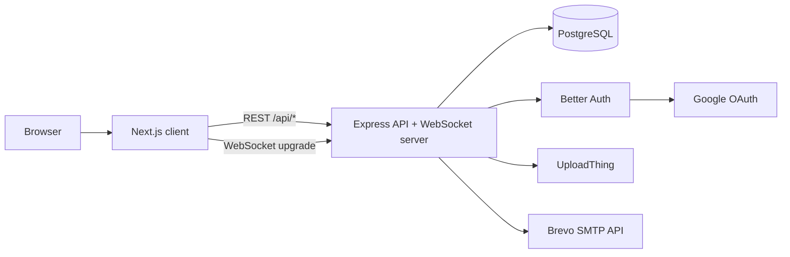
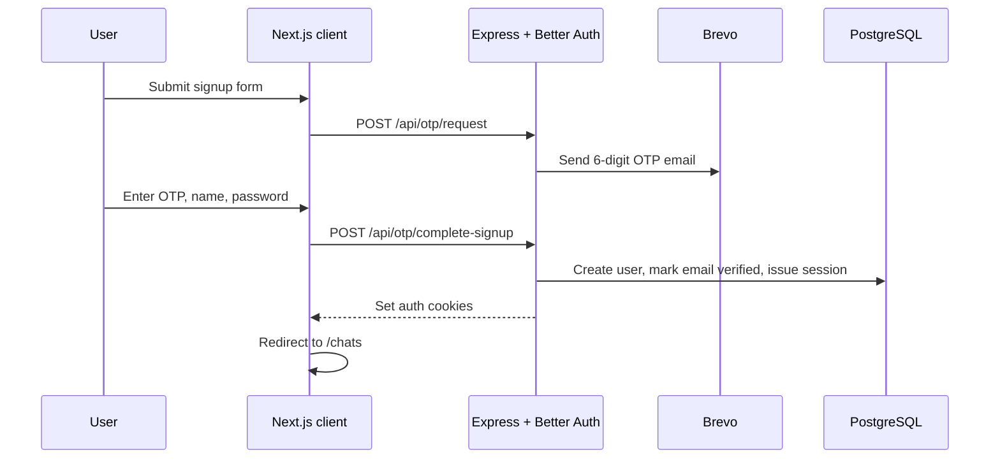
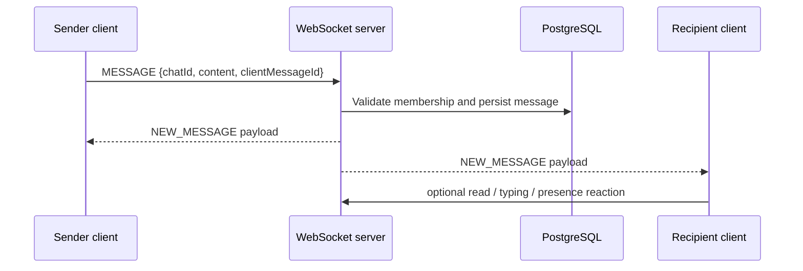

# Synora

> Real-time chat, wired by hand.

<!-- Optional hero banner: add an image such as `docs/banner.png` if you want a visual header. -->

[](https://pnpm.io/)
[](https://turbo.build/)
[](https://nextjs.org/)
[](https://www.typescriptlang.org/)
[](https://www.prisma.io/)

Synora is a websocket-first messaging app with a Next.js client, an Express API, Prisma-backed PostgreSQL persistence, Better Auth sessions, UploadThing uploads, and OTP-based email flows. The codebase is optimized for low-latency conversation state: chats, presence, typing indicators, unread badges, and optimistic message delivery are all coordinated through a shared type-safe protocol.

> [!NOTE]
> This README is derived from the repository contents only. Where the repo does not contain infrastructure or workflow files, that is called out explicitly instead of being guessed.

## Table of Contents

- [Overview](#overview)
- [Features](#features)
- [Tech Stack](#tech-stack)
- [Architecture](#architecture)
- [State Management](#state-management)
- [Folder Structure](#folder-structure)
- [Installation](#installation)
- [Environment Variables](#environment-variables)
- [Running the Project](#running-the-project)
- [Usage](#usage)
- [API Documentation](#api-documentation)
- [Database](#database)
- [Authentication](#authentication)
- [Configuration](#configuration)
- [Scripts](#scripts)
- [Deployment](#deployment)
- [Performance](#performance)
- [Security](#security)
- [Screenshots](#screenshots)
- [Contributing](#contributing)
- [Roadmap](#roadmap)
- [FAQ](#faq)
- [License](#license)
- [Acknowledgements](#acknowledgements)

## Overview

Synora exists to demonstrate and ship a minimal, production-shaped realtime chat stack without the usual polling-heavy compromises. The app combines a landing site, authenticated account flows, direct messaging, presence, typing indicators, unread tracking, and image uploads into one monorepo.

Key benefits supported by the codebase:

- Real-time delivery over persistent WebSocket connections instead of polling.
- Shared protocol types between client and server.
- Optimistic client updates that keep the UI responsive while the server persists data.
- Fine-grained auth and membership checks on every private chat path.
- A small but coherent stack that is easy to reason about in development and production.

## Features

- Landing page with a custom hero, problem statement, features section, protocol walkthrough, and CTA.
- Email/password authentication with required email verification.
- Google OAuth sign-in.
- OTP-driven signup verification sent through Brevo.
- OTP-driven password reset flow.
- One-to-one chat creation from user search.
- Realtime message delivery over WebSockets.
- Presence updates for online/offline status.
- Typing indicators on the active chat.
- Unread counts and read-state tracking per chat member.
- Infinite message history with prefetch on hover and scroll-back pagination.
- Optimistic message insertion while the server confirms delivery.
- Profile image uploads through UploadThing.
- Mobile-aware chat layout with a list/detail split.
- Shared message and websocket types in `packages/types`.

<details>
<summary>Notes on current limitations</summary>

- The schema supports group chats, but the current UI only creates direct conversations.
- A `SEEN` websocket message type exists in shared types and server validation, but I did not find a client-side sender for it.
- There is no Dockerfile or GitHub Actions workflow in the repository.

</details>

## Tech Stack

| Area           | Stack                                                                                                                                                                    |
| -------------- | ------------------------------------------------------------------------------------------------------------------------------------------------------------------------ |
| Frontend       | Next.js 16 App Router, React 19, TanStack Query, Sonner, Tailwind CSS 4, Better Auth React client, UploadThing React helpers                                             |
| Backend        | Express 5, ws, Better Auth node integration, Zod, express-rate-limit, Prisma adapter, WebSocket upgrade handling                                                         |
| Database       | PostgreSQL with Prisma 7.8.0                                                                                                                                             |
| Authentication | Better Auth, email/password, Google OAuth, email verification, password reset OTPs, httpOnly cookies                                                                     |
| AI             | None discovered in the current codebase                                                                                                                                  |
| Infrastructure | pnpm, Turbo, UploadThing, Brevo, Google OAuth, Prisma migrations                                                                                                         |
| Tooling        | TypeScript, ESLint, Prettier, Node `node:test` for the cache regression test                                                                                             |
| Deployment     | Environment-driven; checked-in production env files suggest Vercel for the client, Render for the server, and Neon for Postgres, but no deployment manifests are present |

## Architecture

Synora uses a two-process split:

- The Next.js client renders the landing page, auth flows, and chat UI.
- The Express server owns auth callbacks, OTP flows, chat APIs, file upload routes, and the WebSocket server.
- PostgreSQL stores users, sessions, accounts, chats, memberships, messages, verification records, and OTP state.
- UploadThing stores profile images and chat attachments.
- Brevo sends verification and password-reset emails.
- Google OAuth is wired through Better Auth.



### Auth Flow



### Chat Flow



## State Management

Client state is intentionally split by responsibility:

- Local React state holds form fields, active chat selection, and transient UI toggles.
- TanStack Query caches chats, users, and infinite message pages.
- Better Auth provides session state and sign-in/sign-out helpers.
- WebSocket refs track connection state, presence, typing senders, and reconnect attempts.
- `sessionStorage` temporarily stores pending signup data between the signup and verify screens.

This separation keeps long-lived server state in the query cache while ephemeral UI state stays local to the component that owns it.

## Folder Structure

```text
.
├── apps/
│   ├── client/                # Next.js app: landing page, auth UI, chat UI, shared client helpers
│   │   ├── app/               # App Router pages, layouts, global styles, providers
│   │   ├── components/        # Landing page and UI primitives
│   │   ├── hooks/             # Client-side hooks such as debounce helpers
│   │   └── lib/               # API client, auth client, constants
│   └── server/                # Express API, Prisma schema, websocket server, upload handlers
│       ├── prisma/            # Prisma schema and migration history
│       └── src/               # App bootstrap, routes, services, websocket logic, utilities
├── packages/
│   ├── types/                 # Shared TypeScript types, including websocket protocol types
│   ├── ui/                    # Small reusable React primitives
│   ├── eslint-config/         # Shared ESLint configs
│   └── typescript-config/     # Shared tsconfig presets
├── package.json               # Root scripts for the monorepo
├── pnpm-workspace.yaml        # Workspace package globs
├── turbo.json                 # Turbo task graph and cache inputs
└── README.md                  # This document
```

### Important subtrees

- `apps/client/app/auth/*` contains sign-in, signup, forgot-password, and verify screens.
- `apps/client/app/chats/*` contains the conversation shell, data fetching, and websocket hook.
- `apps/server/src/routes/*` contains the custom HTTP endpoints.
- `apps/server/src/websocket/*` contains auth, connection management, and message handling.
- `apps/server/prisma/schema.prisma` defines the database model.

## Installation

1. Install Node.js 18 or newer and pnpm 9.
2. Install dependencies from the repository root:

   ```sh
   pnpm install
   ```

3. Create local environment files from the examples:
   - `apps/server/.env.local`
   - `apps/client/.env.local`

4. Provision a PostgreSQL database and place its connection string in `apps/server/.env.local` as `DATABASE_URL`.
5. Fill in the auth, OAuth, and email variables listed below.
6. Apply the Prisma schema to the database from the server workspace:

   ```sh
   pnpm --filter server exec prisma migrate dev --name init
   ```

   If you only need to regenerate the client after a schema change, run:

   ```sh
   pnpm --filter server exec prisma generate
   ```

7. Start the apps with the root dev script:

   ```sh
   pnpm dev
   ```

## Environment Variables

### Server

| Variable               | Required | Purpose                                                   |
| ---------------------- | -------- | --------------------------------------------------------- |
| `PORT`                 | No       | Express port. Defaults to `4000` in code.                 |
| `CLIENT_URL`           | Yes      | CORS origin and Better Auth trusted origin.               |
| `DATABASE_URL`         | Yes      | PostgreSQL connection string for Prisma.                  |
| `BETTER_AUTH_URL`      | Yes      | Base URL for Better Auth.                                 |
| `BETTER_AUTH_SECRET`   | Yes      | Secret used by Better Auth to sign or encrypt cookies.    |
| `GOOGLE_CLIENT_ID`     | Yes      | Google OAuth client id.                                   |
| `GOOGLE_CLIENT_SECRET` | Yes      | Google OAuth client secret.                               |
| `BREVO_API_KEY`        | Yes      | API key for OTP emails.                                   |
| `BREVO_SENDER_EMAIL`   | Yes      | Verified Brevo sender address.                            |
| `NODE_ENV`             | No       | Switches cookie attributes and env-file loading behavior. |

### Client

| Variable              | Required    | Purpose                                                                                              |
| --------------------- | ----------- | ---------------------------------------------------------------------------------------------------- |
| `NEXT_PUBLIC_APP_URL` | Recommended | Used for OAuth callback URLs and post-auth redirects. Falls back to `http://localhost:3000` in code. |
| `NEXT_PUBLIC_API_URL` | Yes         | Base URL for REST calls and UploadThing helpers.                                                     |
| `NEXT_PUBLIC_WS_URL`  | Yes         | Base URL for the chat WebSocket connection.                                                          |

### Production-only values seen in the repo

The checked-in production env files also contain `SERVER_URL`, `JWT_SECRET`, and `UPLOADTHING_TOKEN`. These are present in the repository but not directly referenced by the source files I reviewed, so treat them as deployment-time variables that should be verified against your hosting provider’s requirements.

## Running the Project

### Development

From the repository root:

```sh
pnpm dev
```

This runs the Turbo `dev` task across the workspace. The client listens on `3000` and the server listens on `4000` by default.

### Production

The repository provides app-level start scripts, but no Dockerfile or deployment workflow. A typical manual production sequence is:

```sh
pnpm build
pnpm --filter client start
pnpm --filter server start
```

Note that the server `start` script runs `tsx src/app.ts`, so it is still source-based rather than a compiled JS entrypoint.

### Docker

No Dockerfile or compose file was found in the repository.

## Usage

1. Open the landing page and create an account or sign in with Google.
2. For email/password signup, request and enter the OTP sent by Brevo.
3. After verification, you are redirected to `/chats`.
4. Use the chat sidebar to search users and start a direct conversation.
5. Select a chat to load its history, see unread counts clear, and begin sending messages.
6. Type messages or upload images from the composer.
7. Watch presence and typing indicators update in realtime.
8. Upload a profile image from the sidebar avatar if desired.

## API Documentation

### HTTP Endpoints

| Method | Route                                        | Description                                                                                 | Request                                               | Response                                                       | Auth                                     |
| ------ | -------------------------------------------- | ------------------------------------------------------------------------------------------- | ----------------------------------------------------- | -------------------------------------------------------------- | ---------------------------------------- | ------ |
| `GET`  | `/health`                                    | Health check that also verifies the database with `SELECT 1`.                               | None                                                  | `{ status: "ok"                                                | "degraded", timestamp }`                 | Public |
| `ALL`  | `/api/auth/*splat`                           | Better Auth handler for auth-related routes. Exact subroutes are owned by the library.      | Better Auth request payloads                          | Better Auth responses                                          | Varies by subroute                       |
| `POST` | `/api/otp/request`                           | Send a signup verification OTP if the email is not already registered.                      | `{ email }`                                           | `{ message }` or `{ message, alreadySent, retryAfterSeconds }` | Public                                   |
| `POST` | `/api/otp/request-password-reset`            | Request a password reset OTP for an existing account.                                       | `{ email }`                                           | `{ message }` or `{ message, alreadySent, retryAfterSeconds }` | Public                                   |
| `POST` | `/api/otp/complete-signup`                   | Validate the signup OTP, create the user, mark the email verified, and return auth cookies. | `{ email, otp, name, password }`                      | `{ verified: true, message }`                                  | Public, but OTP-gated                    |
| `GET`  | `/api/chats`                                 | List chats for the signed-in user with members, latest message, and unread count.           | None                                                  | `Chat[]`                                                       | Session required                         |
| `POST` | `/api/chats`                                 | Create or reuse a one-to-one chat with another user.                                        | `{ receiverId }`                                      | `Chat`                                                         | Session required                         |
| `GET`  | `/api/chats/users/search?q=...`              | Search users by name, email, or username.                                                   | Query string `q`                                      | User search results                                            | Session required                         |
| `POST` | `/api/chats/:chatId/read`                    | Mark a chat as read for the current member.                                                 | None                                                  | `{ chatId, unreadCount: 0, lastReadAt }`                       | Session required and membership required |
| `GET`  | `/api/chats/:chatId/messages?limit=&before=` | Fetch paginated chat messages in reverse chronological order.                               | Query string `limit`, optional `before` ISO timestamp | `Message[]`                                                    | Session required and membership required |
| `POST` | `/api/uploadthing`                           | UploadThing route handler for profile images and chat attachments.                          | UploadThing request body                              | UploadThing response                                           | Session required by route middleware     |

### Realtime Protocol

| Type          | Direction         | Purpose                                          | Notes                                                                                                    |
| ------------- | ----------------- | ------------------------------------------------ | -------------------------------------------------------------------------------------------------------- |
| `MESSAGE`     | Client to server  | Send a chat message.                             | Requires `chatId`, `content`, and optional `clientMessageId`.                                            |
| `NEW_MESSAGE` | Server to clients | Deliver a persisted message to all chat members. | Includes sender metadata and timestamps.                                                                 |
| `TYPING`      | Bidirectional     | Emit and display typing state.                   | Server forwards to other chat members only.                                                              |
| `PRESENCE`    | Server to clients | Announce user online/offline changes.            | Broadcast to users who share chats with the affected user.                                               |
| `SEEN`        | Server-side type  | Reserved seen/read event.                        | Defined in shared types and validated server-side; I did not find a client sender in the current source. |

## Database

The schema is defined in `apps/server/prisma/schema.prisma` and uses PostgreSQL.

### Models

| Model          | Purpose                                                                                               |
| -------------- | ----------------------------------------------------------------------------------------------------- |
| `User`         | Authenticated user profile, including name, email, optional username, avatar, and verification state. |
| `Session`      | Better Auth session token and metadata such as IP and user agent.                                     |
| `Account`      | OAuth or credential-linked account records for Better Auth.                                           |
| `Chat`         | Conversation container with optional name and `isGroup` flag.                                         |
| `ChatMember`   | Join table between users and chats with `lastReadAt`.                                                 |
| `Message`      | Persisted chat messages with sender, chat, and timestamp.                                             |
| `Verification` | Better Auth verification records, also used by the password-reset cooldown logic.                     |
| `OTP`          | Signup OTP storage with expiry, attempt counting, and a `used` flag.                                  |

### Relationships

- `User` has many `Session`, `Account`, `ChatMember`, and `Message` rows.
- `Chat` has many `ChatMember` rows and many `Message` rows.
- `ChatMember` belongs to one `User` and one `Chat` and stores per-member read state.
- `Message` belongs to one `Chat` and one `User` as sender.
- `Session` and `Account` cascade-delete with their owning user.
- `ChatMember` and `Message` cascade-delete when a related chat or user is removed.

### Schema Notes

- `User.username` is unique and optional.
- `User.emailVerified` is used by the auth flow after OTP validation.
- `User.isPro` exists in the schema but I did not find any runtime usage in the current source.
- `ChatMember.lastReadAt` drives unread counts.
- `Message` has an index on `(chatId, createdAt)` for message history access.
- `OTP` stores hashed codes, not raw codes.

## Authentication

Synora uses Better Auth on both the client and server.

### Login Flow

- Email/password sign-in is available from the auth screens.
- Google sign-in is initiated from the client with a callback URL pointing back to `/chats`.
- The auth layout redirects authenticated users away from `/auth/*` and into the chat area.

### Signup Flow

- The signup form first calls `POST /api/otp/request`.
- The client stores pending signup details in `sessionStorage` under `synora_signup_pending`.
- The verify screen reads the OTP from the URL and the pending payload from `sessionStorage`.
- `POST /api/otp/complete-signup` creates the user, marks email verification complete, and returns auth cookies.

### Password Reset Flow

- The forgot-password form calls `POST /api/otp/request-password-reset`.
- The verify screen switches into reset mode when `mode=reset` is present.
- The client uses Better Auth’s email OTP reset helper, then signs the user in after success.

### Authorization

- Private HTTP routes call `getSessionFromHeaders` before touching chat data.
- Chat membership is checked before reading messages, creating chats, or writing message events.
- The WebSocket upgrade path authenticates either via a session cookie or a `token` query parameter.
- UploadThing routes also require a valid session.

## Configuration

<details>
<summary>Key files and what they control</summary>

| File                              | Purpose                                                                 |
| --------------------------------- | ----------------------------------------------------------------------- |
| `apps/client/app/layout.tsx`      | Root HTML shell, metadata, and local font setup.                        |
| `apps/client/app/globals.css`     | Tailwind v4 theme tokens, custom animations, and visual language.       |
| `apps/client/app/providers.tsx`   | TanStack Query client and Sonner toaster setup.                         |
| `apps/client/next.config.ts`      | Remote image allowlist for Google avatars and UploadThing URLs.         |
| `apps/client/eslint.config.mjs`   | Next.js ESLint rules and ignores.                                       |
| `apps/server/src/config/env.ts`   | Loads `.env.local` in development or `.env.prod` in production.         |
| `apps/server/prisma.config.ts`    | Prisma CLI env loading and datasource wiring.                           |
| `apps/server/src/lib/validate.ts` | Zod request validation for body, params, query, and websocket payloads. |
| `turbo.json`                      | Monorepo task graph, caching, and env inputs.                           |
| `pnpm-workspace.yaml`             | Workspace package globs.                                                |

</details>

## Scripts

### Root `package.json`

| Script        | Command                               | Purpose                                 |
| ------------- | ------------------------------------- | --------------------------------------- |
| `build`       | `turbo run build`                     | Build all workspace packages and apps.  |
| `dev`         | `turbo run dev`                       | Start all dev tasks.                    |
| `lint`        | `turbo run lint`                      | Run lint tasks across the workspace.    |
| `format`      | `prettier --write "**/*.{ts,tsx,md}"` | Format TypeScript and Markdown files.   |
| `check-types` | `turbo run check-types`               | Run type checking across the workspace. |

### `apps/client/package.json`

| Script  | Command      | Purpose                             |
| ------- | ------------ | ----------------------------------- |
| `dev`   | `next dev`   | Start the Next.js dev server.       |
| `build` | `next build` | Build the client app.               |
| `start` | `next start` | Start the client production server. |
| `lint`  | `eslint`     | Lint the client app.                |

### `apps/server/package.json`

| Script  | Command                                     | Purpose                                        |
| ------- | ------------------------------------------- | ---------------------------------------------- |
| `dev`   | `tsx watch src/app.ts`                      | Start the server in watch mode.                |
| `test`  | `echo "Error: no test specified" && exit 1` | Placeholder only; not a real test runner.      |
| `start` | `tsx src/app.ts`                            | Start the server from source.                  |
| `build` | `prisma generate && tsc`                    | Generate Prisma client and compile TypeScript. |

### `packages/ui/package.json`

| Script               | Command                     | Purpose                         |
| -------------------- | --------------------------- | ------------------------------- |
| `lint`               | `eslint . --max-warnings 0` | Lint the UI package.            |
| `generate:component` | `turbo gen react-component` | Scaffold a new React component. |
| `check-types`        | `tsc --noEmit`              | Type check the package.         |

### `packages/types/package.json`

| Script        | Command                                        | Purpose                  |
| ------------- | ---------------------------------------------- | ------------------------ |
| `dev`         | `echo types package has no runtime dev server` | No runtime process.      |
| `check-types` | `tsc --noEmit`                                 | Type check shared types. |

### Testing status

- The only explicit test file I found is `apps/client/app/chats/lib/messages-query.test.ts`.
- It verifies message query keys, cache freshness, and prefetch behavior.
- There is no dedicated root `test` script and no broader automated test suite wired into package scripts in the current repo.

## Deployment

There are no Dockerfiles, compose files, or GitHub Actions workflows in the repository.

The checked-in production env files suggest a deployment split where:

- the client is hosted on Vercel,
- the server is hosted on Render,
- PostgreSQL is provided by Neon,
- uploads are handled by UploadThing,
- email verification is sent through Brevo.

That is the clearest deployment story visible from the codebase, but it is still an inference from env files rather than an explicit infrastructure definition.

## Performance

The following optimizations are implemented in code:

- TanStack Query keeps message data fresh for 60 seconds to support fast chat switching.
- Chat message pages are prefetched on hover and pointer down.
- The active chat view uses optimistic message inserts to avoid waiting on the server round-trip.
- Live WebSocket appends cancel in-flight message fetches so stale HTTP data cannot overwrite realtime state.
- Infinite message pagination loads older messages by cursor (`before`) instead of refetching the full history.
- The WebSocket client reconnects with exponential backoff and reopens when the page regains focus or visibility.
- `express.json` is limited to 10 KB, and the WebSocket server caps payloads at 16 KB.
- The API uses rate limiting on chat and OTP routes.

## Security

Security-related practices visible in the repository include:

- Better Auth session cookies are configured as `httpOnly`.
- Cookie `secure` and `sameSite` behavior changes based on production mode.
- CORS is restricted to `CLIENT_URL` and uses credentials.
- OTP endpoints are rate limited.
- Request bodies, query strings, params, and websocket messages are validated with Zod.
- Passwords are hashed with `bcryptjs` before OTP signup completes.
- Chat APIs verify membership before returning or mutating private conversation data.
- WebSocket upgrades authenticate before the socket is accepted.
- UploadThing routes reject unauthorized users.
- OTP storage uses hashed codes and tracks expiry and retry attempts.

## Screenshots

Add screenshots here when you capture the app in a real environment.

| View             | Suggested file                     |
| ---------------- | ---------------------------------- |
| Landing page     | `docs/screenshots/landing.png`     |
| Sign in          | `docs/screenshots/signin.png`      |
| Sign up          | `docs/screenshots/signup.png`      |
| Chats            | `docs/screenshots/chats.png`       |
| Mobile chat view | `docs/screenshots/mobile-chat.png` |

## Contributing

1. Fork the repository and create a feature branch.
2. Make focused changes that keep the auth, chat, and schema layers consistent.
3. Run the relevant checks before opening a pull request:

   ```sh
   pnpm lint
   pnpm check-types
   pnpm build
   ```

4. If you change the Prisma schema, create or update migrations in `apps/server/prisma/migrations`.
5. If you touch websocket payloads, update the shared types in `packages/types/src/ws.ts` first so the client and server stay aligned.
6. Keep documentation honest. If a feature is not implemented in the source, do not describe it as if it exists.

## Roadmap

These are the most obvious next steps implied by the current codebase:

- Add a UI for creating and managing group chats.
- Surface explicit read receipts using the existing `SEEN` protocol path.
- Add attachment types beyond a single image per upload flow if needed.
- Replace the placeholder server test script with a real automated test command.
- Add CI workflows for linting, type checking, and build validation.
- Add Docker or deployment manifests if you want the infrastructure to be reproducible from the repository alone.
- Consider wiring `isPro` into product logic if a subscription or entitlement layer is planned.

## FAQ

<details>
<summary>Does Synora support group chats?</summary>

The schema does. The current UI and API flow I found create one-to-one chats, so group chat creation is not exposed yet.

</details>

<details>
<summary>How does realtime messaging work?</summary>

The client opens a WebSocket connection, sends a `MESSAGE` payload, the server validates membership, saves the message, and fans out a `NEW_MESSAGE` event to chat members.

</details>

<details>
<summary>Where do uploads go?</summary>

Uploads go through UploadThing. Profile image uploads update the signed-in user record, and chat attachments return a URL that is sent through the chat composer.

</details>

<details>
<summary>Is there a Docker setup?</summary>

No. I did not find a Dockerfile or compose file in the repository.

</details>

<details>
<summary>What test coverage exists today?</summary>

The only explicit test file I found is a Node test that exercises chat message cache behavior. There is no broader test runner wired into package scripts yet.

</details>

## License

Placeholder. Add the actual license when the project is ready to publish.

## Acknowledgements

Synora is built on top of:

- Next.js
- React
- Turbo
- pnpm
- Prisma
- Better Auth
- PostgreSQL
- TanStack Query
- UploadThing
- Brevo
- Express
- ws
- Tailwind CSS
- Zod
